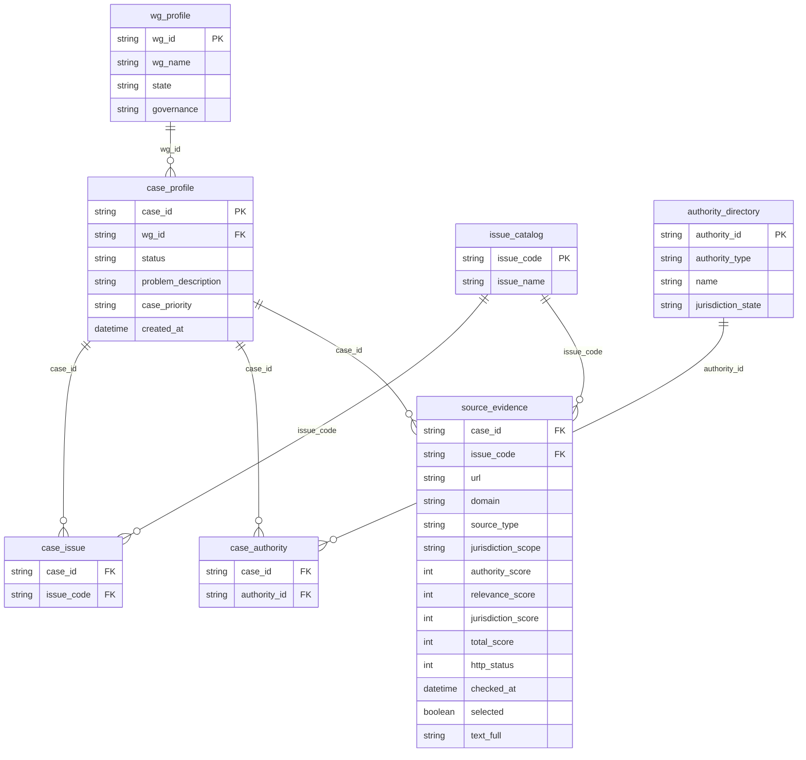

# Pflege-WG Rechtsfinder – DB Diagram (aktueller Stand + Zielmodell)

> Stand: n8n Data Tables (aus Workflow-Export) – Schema abgeleitet aus den aktuell gemappten Spalten. fileciteturn5file0

## Aktuelle Tabellen (n8n Data Tables)

Hinweis: In n8n existiert zusätzlich i. d. R. eine interne Row-ID (z. B. `id`) je Tabelle, die im Schema-Mapping nicht immer sichtbar ist.

## wg_profile

| Spalte                      | Typ        |
| --------------------------- | ---------- |
| `wg_id`                     | `string`   |
| `wg_name`                   | `string`   |
| `address_text`              | `string`   |
| `state`                     | `string`   |
| `district`                  | `string`   |
| `municipality`              | `string`   |
| `governance`                | `string`   |
| `residents_total`           | `number`   |
| `residents_with_pg`         | `number`   |
| `target_group`              | `string`   |
| `has_24h_presence`          | `boolean`  |
| `has_presence_staff`        | `boolean`  |
| `care_provider_mode`        | `string`   |
| `lease_individual`          | `boolean`  |
| `care_individual`           | `boolean`  |
| `bundle_housing_care`       | `boolean`  |
| `sgb_xi_used`               | `boolean`  |
| `sgb_xii_involved`          | `boolean`  |
| `sgb_v_hkp`                 | `boolean`  |
| `landesrecht_title`         | `string`   |
| `landesrecht_url`           | `string`   |
| `heimaufsicht_contact_hint` | `string`   |
| `notes`                     | `string`   |
| `created_at`                | `dateTime` |
| `updated_at`                | `dateTime` |

## case_profile

| Spalte                | Typ        |
| --------------------- | ---------- |
| `case_id`             | `string`   |
| `wg_id`               | `string`   |
| `case_title`          | `string`   |
| `status`              | `string`   |
| `problem_description` | `string`   |
| `issue_categories`    | `string`   |
| `authority_targets`   | `string`   |
| `required_docs`       | `string`   |
| `next_actions`        | `string`   |
| `deadlines`           | `string`   |
| `source_links`        | `string`   |
| `attachments`         | `string`   |
| `case_priority`       | `string`   |
| `owner`               | `string`   |
| `created_at`          | `dateTime` |
| `updated_at`          | `dateTime` |
| `last_reviewed_at`    | `dateTime` |

## source_evidence

| Spalte                | Typ        |
| --------------------- | ---------- |
| `case_id`             | `string`   |
| `issue_code`          | `string`   |
| `url`                 | `string`   |
| `domain`              | `string`   |
| `title`               | `string`   |
| `source_type`         | `string`   |
| `jurisdiction_scope`  | `string`   |
| `evidence_excerpt`    | `string`   |
| `claim_supported`     | `string`   |
| `authority_score`     | `number`   |
| `relevance_score`     | `number`   |
| `jurisdiction_score`  | `number`   |
| `total_score`         | `number`   |
| `http_status`         | `number`   |
| `checked_at`          | `dateTime` |
| `selected`            | `boolean`  |
| `Text_Full`           | `string`   |
| `wg_id`               | `string`   |
| `case_title`          | `string`   |
| `status`              | `string`   |
| `problem_description` | `string`   |
| `issue_categories`    | `string`   |
| `authority_targets`   | `string`   |
| `required_docs`       | `string`   |
| `next_actions`        | `string`   |

## Beziehungen (Ist-Zustand)

-   `case_profile.wg_id` → referenziert `wg_profile.wg_id`.

-   `source_evidence.case_id` → referenziert `case_profile.case_id`.

-   `source_evidence.issue_code` → referenziert konzeptionell `issue_catalog.issue_code` (aktuell: freies Stringfeld).

-   `case_profile.issue_categories` und `case_profile.authority_targets` sind aktuell **Semikolon-Strings** (keine echten Relations-Tabellen).

## ER-Diagramm (Ist-Zustand)

```mermaid
erDiagram

  WG_PROFILE {

    STRING wg_id

    STRING wg_name

    STRING address_text

    STRING state

    STRING district

    STRING municipality

    STRING governance

    NUMBER residents_total

    NUMBER residents_with_pg

    STRING target_group

    BOOLEAN has_24h_presence

    BOOLEAN has_presence_staff

    STRING care_provider_mode

    BOOLEAN lease_individual

    BOOLEAN care_individual

    BOOLEAN bundle_housing_care

    BOOLEAN sgb_xi_used

    BOOLEAN sgb_xii_involved

    BOOLEAN sgb_v_hkp

    STRING landesrecht_title

    STRING landesrecht_url

    STRING heimaufsicht_contact_hint

    STRING notes

    DATETIME created_at

    DATETIME updated_at

  }

  CASE_PROFILE {

    STRING case_id

    STRING wg_id

    STRING case_title

    STRING status

    STRING problem_description

    STRING issue_categories

    STRING authority_targets

    STRING required_docs

    STRING next_actions

    STRING deadlines

    STRING source_links

    STRING attachments

    STRING case_priority

    STRING owner

    DATETIME created_at

    DATETIME updated_at

    DATETIME last_reviewed_at

  }

  SOURCE_EVIDENCE {

    STRING case_id

    STRING issue_code

    STRING url

    STRING domain

    STRING title

    STRING source_type

    STRING jurisdiction_scope

    STRING evidence_excerpt

    STRING claim_supported

    NUMBER authority_score

    NUMBER relevance_score

    NUMBER jurisdiction_score

    NUMBER total_score

    NUMBER http_status

    DATETIME checked_at

    BOOLEAN selected

    STRING Text_Full

    STRING wg_id

    STRING case_title

    STRING status

    STRING problem_description

    STRING issue_categories

    STRING authority_targets

    STRING required_docs

    STRING next_actions

  }


  WG_PROFILE ||--o{ CASE_PROFILE : wg_id

  CASE_PROFILE ||--o{ SOURCE_EVIDENCE : case_id

```

# Zielmodell (PSQL/normalisiert) – Empfehlung

Ziel: Strings wie `issue_categories`/`authority_targets` in echte M:N-Relationen überführen und Evidence/RAG sauber versionieren.

## Empfohlene Normalisierung

-   `issue_catalog(issue_code PK)` und `authority_directory(authority_id PK)` werden echte Referenztabellen.

-   `case_issue(case_id, issue_code)` als Join-Tabelle.

-   `case_authority(case_id, authority_id|authority_type)` als Join-Tabelle.

-   `source_evidence` wird schlanker: enthält FK auf `case_id` + `issue_code` + `url` und die Scores + Volltext/Dateipfad.

-   Optional: `evidence_document` (Text/PDF, Hash, fetched_at, storage_path) und `evidence_chunk` (für RAG/Embeddings).

## ER-Diagramm (Zielmodell, Vorschlag)

